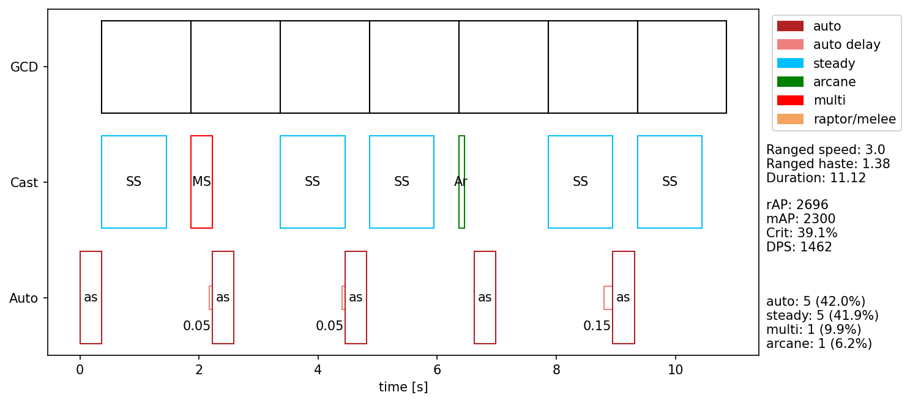

# TBC Shot Rotations

This is not a guide; this is a current summary of hunter rotation theorycrafting; this will not tell you how to play hunter in TBC; this **will** change multiple times before TBC is out; this is going to get a little wordy in places.

**Shot notation:** rotations are often shorthanded to a form like 2:1 where 2 and 1 indicate the number of Steady Shots and Auto Shots respectively.  Some rotations are generalized further; e.g. x-1:x is the rotation with 1 less steady shot than auto shot.

Some terms:
 - effective weapon speed/swing (eWS) is your ranged swing time after haste.
 - TC = theorycrafting
 - BM haste refers to the 20% ranged haste talent in the penultimate row of the Beast Mastery talent tree, Serpent's Swiftness.

## Haste

There is no concept of a haste softcap or diminishing returns for hunters as a whole; **more haste is better.**  There are hard hastecaps for individual rotations; however, when you hit one of these you should have already transitioned to a higher DPS rotation which will continue to scale with haste.  


# Rotations from slow effective weapon speed to fast

## 2:1

The rotation suited best for incredibly slow eWS is 2:1 `auto - steady - steady`.  You would certainly use this for situations where your eWS is 3.0 and greater, substituting steady shots for Multi-Shot on cooldown.  Currently, the French rotation seems to beat 2:1 for all eWS except Survival Hunters using Nerubian Slavemaker with 0 haste effects: you likely will never 2:1.

## 3:2

The mechanic that made 3:2 interesting (GCD desync) does not work in classic or on the beta.  3:2 is outclassed at all effective weapon speeds by other rotations. See [here](https://boukx.github.io/threetwo/) for slightly outdated explanation.

## The French Rotation (5:5:1:1)

A variation of the TBC-theorycrafted 1:1.5, the French rotation uses the difference in GCD and cast time of Multi-Shot and Arcane Shot to pack more casts into a short space of time than for eWS ranging from 2.8 -> 1.8.  It diverges from 1:1.5 in that it repeats twice and then is followed by 1:1 to allow multi to come off of CD.

```
auto - steady - multi
auto - steady
auto - steady - arcane
auto - steady
auto - steady
```



**This will be BM and SV's bread and butter rotations when not under any haste effects** beyond quiver and BM haste.

### 5:6:1:1 

An almost exotic variant of the French rotation, you might use 5:6:1:1 around 1.9->1.7 eWS when you are between the French rotation and 1:1ing.

```
auto - steady - arcane
auto - multi
auto - steady
auto - steady
auto - steady
auto - steady
```

### Weaving variants of the French rotation

For weapon speeds still too slow for 1:1, the best DPS comes from weaving through the French rotation.  The most optimal way to do this seems to be the French 2 weave, weaving after the Auto Shot following Arcane and Multishot.


If you are hasted by drums only, you could switch to French 3 weave (below).  Any more haste than just drums (and Bm/quiver) and you would move to 1:1 weaving.


## 1:1

1:1 is a simple rotation: `auto - steady... repeat`.  You will start 1:1ing some time before your eWS is actually at 1.5 but fairly quickly transition into x-1:x rotations if your eWS dips below 1.5.

## x-1:x

Old TC says that haste bringing your weapon speed below 1.5 is extraneous and silly.  Old TC is dumb.  As your eWS dips below 1.5, your autos will start to drift such that you are actually delaying your auto with your steady cast.  When this happens want to let an additional auto go through before your next steady to "reset" your auto swing to before steady.  This results in a denser packing of steadies and autos.  Here's a picture.


The closer your eWS to 1.5, the more shots this will take you-- to the point where you may not even do this catch up auto before your haste changes again.  With something like a 2.5 haste modifier, you'd do 2:3 as shown above.

For any classic hunters, this is sort of how prioing Multi-shot over Aimed Shot causes them to always come off CD at the same time.  Once you prio Aimed once, they remain staggered for several rotations before you have to delay multi again.

### x-1:x with multi

Ideally, you would use Multi-Shot's lower cast time as the shot before you let back-to-back autos go through to even pack your GCDs and Auto's even denser.


### Weaving 1:1 and x-1:x

Weaving through 1:1 most easily is just raptor striking on cooldown.  If you are pure 1:1ing, you should have at least .38s of free time each rotation to stutter forward, hit the raptor button, and stutter out.  With no deadzone in TBC _and the fact that Raptor is our highest damage ability_ you should be seeking to weave on all bosses that allow it.

_(.38 is taking the haste required to get a fast (2.7s) bow to 1.5 eWS is 1.8 haste mod, .5 + 1.5 (auto and steady cast) / 1.8 -> 1.11 seconds of casts, .38 seconds of weave time)_

On the lower end of haste, weaving in normal melee hits is a DPS gain as well.

If x-1:x'ing, you'd ideally like to weave between the back-to-back auto's you occasionally fire.  As you approach 1:x, weaving becomes a DPS **risk** _in practice_, as a single positioning issue could delay you several autos in the fleeting time you're at this high haste; however in theory it remains a DPS gain until your eWS is somewhere below .3 seconds.

## 1:x

The ultimate chad rotation, you begin 1:xing around the time where your eWS is less than your `GCD - Steady Cast Time`.  You'll start with 1:2, and if you're lucky maybe make it to 1:3 with some insane haste numbers.

Only gods among us will ever reach the fated 1:4.

# But, how

There is a lot of impractical theorycrafting being discussed here and in [the hunter discord](https://discord.gg/8TVHxRr) right now.  **That's good.**  We don't expect hunters to be 400iq button mashing machines.  The point of much of this theory is to be theory.  As we work more of it out, get better in-game numbers from the beta, and develop more tools, we'll turn the theory into actionable advice to hunters of all levels.  If you're interested in helping with that process or just awaiting some solid advice, join [the discord](https://discord.gg/8TVHxRr).  We will  make sure the best information is available there as we get closer to entering the Outlands.

# Attribution

This is an ongoing effort within [the hunter discord](https://discord.gg/8TVHxRr).  There are countless individuals who have contributed to this theory in passing, as well as supported it via testing on the beta or in other ways. 

In no particular order, thank you Aegaehg and Colton for your help; Kanja for all your amazing [theorycrating and guide work](https://chasseur-bc.jimdofree.com/); Chitzen for translating and your contributions especially regarding exotic rotations; and Diziet for both your theory work and the indescribably useful visualization tool you wrote.